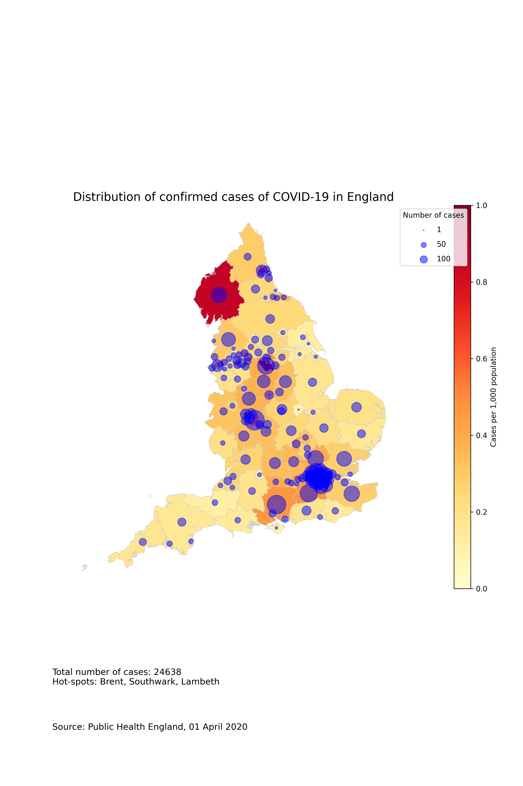

# Distribution of COVID-19 cases in England

Daily analysis of distribution of COVID-19 cases in England, based on data from Public Health England.

## Methodology

Data for COVID-19 cases are published by Public Health England (PHE) daily for Upper Tier Local Authority (UTLA) areas in England.

These are merged with data from the Office for National Statistics (ONS) on populations, in order to show the density of COVID-19 cases.

## Results

## Sources

1. Total COVID-19 cases: PHE (https://www.arcgis.com/sharing/rest/content/items/bc8ee90225644ef7a6f4dd1b13ea1d67/data, updated daily, .xlsx format)
2. Cases by UTLA: PHE (https://www.arcgis.com/sharing/rest/content/items/b684319181f94875a6879bbc833ca3a6/data, updated daily, .csv format)
3. UTLA shapefile: ONS Open Geography Portal (https://geoportal.statistics.gov.uk/datasets/counties-and-unitary-authorities-december-2016-generalised-clipped-boundaries-in-england-and-wales)
4. Population by UTLA: ONS (https://www.ons.gov.uk/peoplepopulationandcommunity/populationandmigration/populationprojections/datasets/localauthoritiesinenglandtable2)
